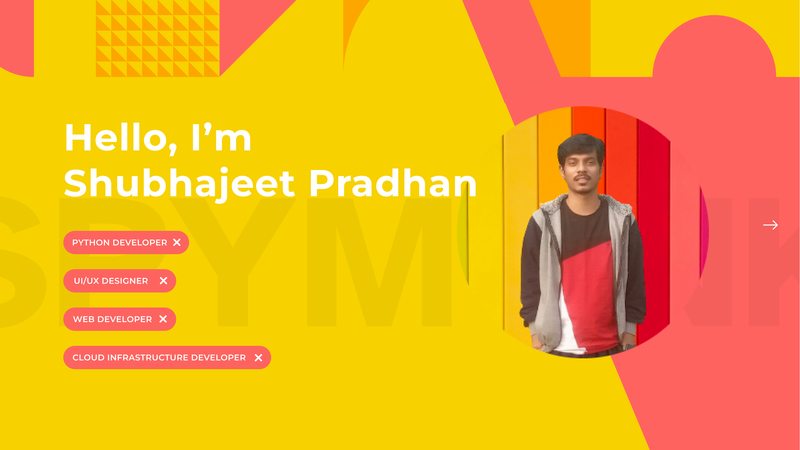

    

    
Hi. I am [Shubhajeet Pradhan](https://shubhajeetpradhan.netlify.app), IT student at [ABV-Indian Institute of Information Technology and Management, Gwalior]([https://www.tuni.fi/en](https://www.iiitm.ac.in/index.php/en/)) and tech enthusiast from
[India](https://en.wikipedia.org/wiki/India). I'm a Python Developer at [Alfalgo](https://main.d1kndt2f1p1c10.amplifyapp.com) in Tamil Nadu, India.  I am most interested in Python development, UI/UX and Cloud infrastructure development and everything around it. Get in touch with me using the links below.

)

##  Articles on Medium

<!-- BLOG-POST-LIST:START -->
- [5 Things You Need to Know When Designing for Users with Disabilities](https://medium.com/@spymonk/5-things-you-need-to-know-when-designing-for-users-with-disabilities-b667d7dcdfe3)
- [Get Handy with Django](https://medium.com/tech-iiitg/get-handy-with-django-9e6a7e3e3a71)
- [Django Troubleshooting: Part I](https://medium.com/@spymonk/django-troubleshooting-part-i-4d0a2c366270)

<!-- BLOG-POST-LIST:END -->

➡️ [more blog posts...](https://medium.com/@spymonk)
    
 

  

More statistics

